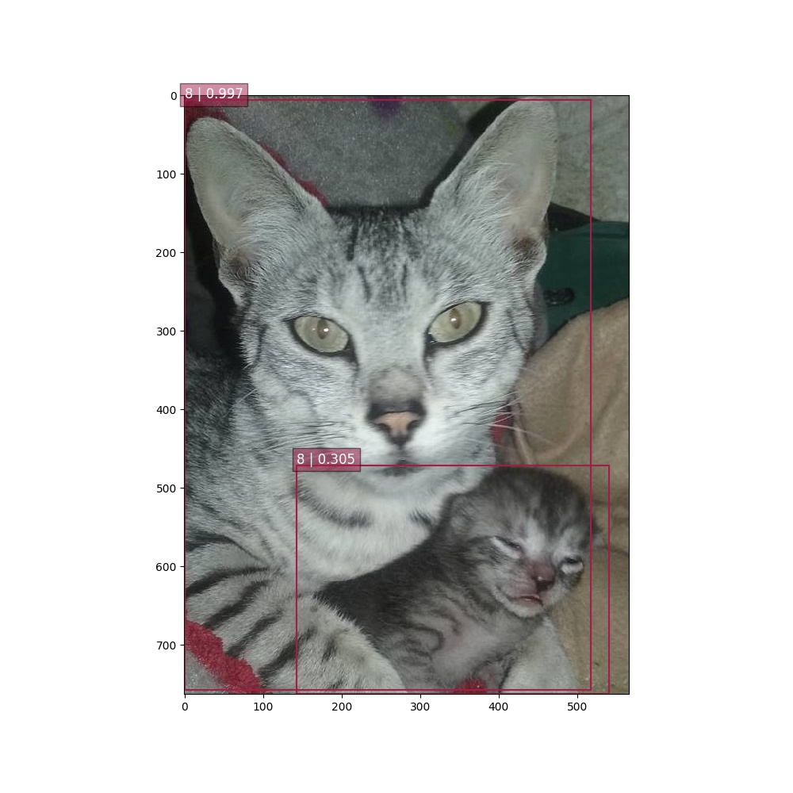
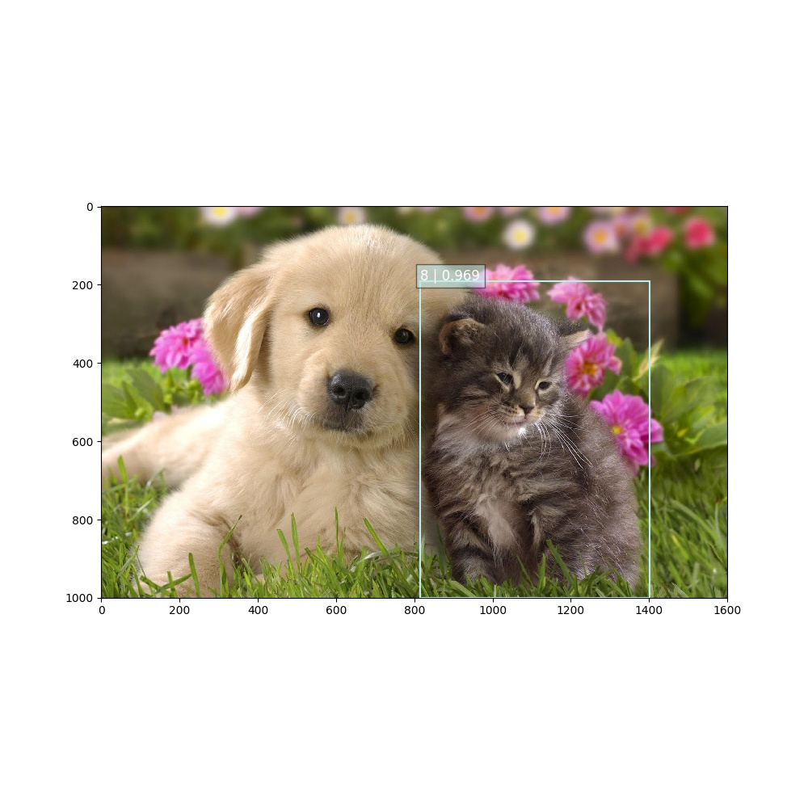

## Aim of the Project

To create a model which can be used to recognize and annotate cats in photos.  

1. Train the model 
2. Apply the model onto test set of images (test_set.zip) and draw bounding boxes around cats on the test set as such:

## SSD: Single Shot MultiBox Detector

### Why did I chose SSD ?

Faster R-CNN, YOLO and Single Shot MultiBox Detector are the present state-of-the-art in using CNN for object detection. Even though there are a few differences between the three previous approaches, they share the same general pipeline. Namely, the detection network is designed based on the following rules:

Use a deep convolutional network trained on ImageNet as a multi-scale source of features. Typically, VGG, ResNet or Inception;

Provide a collection of pre-defined anchors boxes tiling the image at different positions and scales. They serve the same purpose as the sliding window approach in classic CV detection algorithms;

For every anchor box, the modified CNN provides a probability for every class of object (and a no detection probability), and offsets (x, y, width and height) between the detected box and the associated anchor box.

The detection output of the network is post-processed using a Non-Maximum Selection algorithm, in order to remove overlapping boxes.

For this project, I chose SSD detector, as the later provides a good compromise between accuracy and speed.

## What is SSD?

It is  method for detecting objects in images using a single deep neural network. This approach discretizes the output space of bounding boxes into a set of default boxes over different aspect ratios and scales per feature map location. At prediction time, the network generates scores for the presence of each object category in each default box and produces adjustments to the box to better match the object shape. Additionally, the network combines predictions from multiple feature maps with different resolutions to naturally handle objects of various sizes. The model is simple relative to methods that require object proposals because it completely eliminates proposal generation and subsequent pixel or feature resampling stage and encapsulates all computation in a single network. This makes SSD easy to train and straightforward to integrate into systems that require a detection component. 
I used VGG as a based architecture as it provides high quality features at different scales, the former being then used as inputs for multibox modules in charge of computing the object type and coordinates for each anchor boxes. The architecture of the network we use is illustrated in the following TensorBoard graph. It follows the original SSD paper:

Implementation of the SSD VGG-based 512 network.
    The default features layers with 512x512 image input are:
      * conv4 ==> 64 x 64
      * conv7 ==> 32 x 32
      * conv8 ==> 16 x 16
      * conv9 ==> 8 x 8
      * conv10 ==> 4 x 4
      * conv11 ==> 2 x 2
      * conv12 ==> 1 x 1
  The default image size used to train this network is 512x512.

## SSD Training and Testin Scripts

### Approach 

As Training the network was computationally expensive in my laptop I chose to load the network with pretrained weights from 
the follwing check point (VGG-based, trained on VOC07+12+COCO trainval). But I have included the script to train and fine tune the network.

https://drive.google.com/open?id=0B0qPCUZ-3YwWT1RCLVZNN3RTVEU

This model implements VGG-based SSD networks (with 300 and 512 inputs). This TF checkpoint is directly converted from SSD Caffe model.I started with 300 input checkpoints but found the detection rate was not satisfactory and so adopted the 512 inputs checkpoint.

## Testing 

The [SSD Notebook](notebooks/single_shot_detector.ipynb) contains SSD TensorFlow pipeline to apply the model onto test set of images (test_set.zip) and draw bounding boxes around cats on the test set . 

The detection is made of two main steps; running the SSD network on the image and Post-processing the output using top-k filtering and Non-Maximum Suppression algorithm.

Here are two examples of successful detection outputs:

## Training the Model

[SSD Notebook](notebooks/Training Script.ipynb) contains the script for training the model. Data for training can be downloaded from the site http://host.robots.ox.ac.uk/pascal/VOC/voc2012/VOCtrainval_11-May-2012.tar. The current version only supports Pascal VOC datasets (2007 and 2012). In order to be used for training a SSD model, the former need to be converted to TF-Records using the [Convert Data to tfr format](tf_convert_data.py) tf_convert_data.py script:this step will have generated a collection of TF-Records instead of a single file in order to ease shuffling during training. The script train_ssd_network.py is in charged of training the network. Similarly to TF-Slim models, one can pass numerous options to the training process (dataset, optimiser, hyper-parameters, model, ...). In particular, it is possible to provide a checkpoint file which can be use as starting point in order to fine-tune a network.

## Output:

The test set of different file formats was successfully run through the model and a satisfactory detection of cats was attained and bounding boxes were drawn around the cats. The output is save in the folder [Output](./Output)   

## How I improved on accuracy?

My initial submission a week ago was on the Tiny YOLO model. Which was giving me a fairly poor detection rate.

#### Why SSD over YOLO .
    
SSD model adds several feature layers to the end of a base network, which predict the offsets to default boxes of different scales and aspect ratios and their associated confidences. SSD with a 300 × 300 input size significantly outperforms its 448 × 448 YOLO counterpart in accuracy on VOC2007 test while also improving the speed.The box position relative to each feature map location (cf the architecture of YOLO that uses an intermediate fully connected layer instead of a convolutional filter for this step).

####  Why SSD 512x512 over SSD 300x300
indeed SSD with a 300 x300 input size was defenitely better than the YOLO detection but in my search for perfection I could see the SSD with 512x 512 could give a more precise output.Increasing the input size (e.g. from 300×300 to 512×512) can help improve detecting small objects, but there is still a lot of room to improve. SSD performs really well on large objects. And it is very robust to different object aspect ratios because default boxes of various aspect ratios are used per feature map location.

Within this model playing around with threshold value lately set to 0.2 and nms threshold(NMS is therefore to retain only one window per group, corresponding to the precise local maximum of the response function, ideally obtaining only
one detection per object) lately set to 0.45 could improve the detection. 

## Areas of Improvement:

The cat detection is clearly far from perfect as it is now! There are several parts of the pipeline which could be improved: 
1. Other architectures than VGG could be investigated (ResNet, Inception V4 etc.). 
2. For better accuracy, Faster R-CNN with Inception ResNet V2 may be used. This combination has shown better accuracy in various test data.
3. This network is designed to detect 21 object classes. We could design and train a smaller network to work only on cats. This will reduce time required for forward pass.
